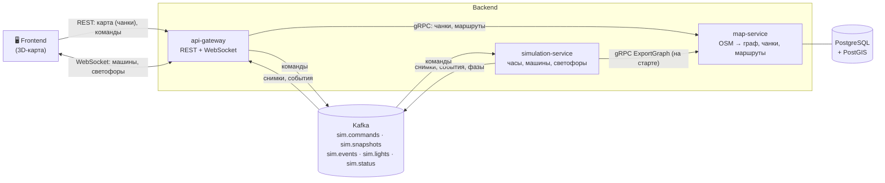

# SynthCity


**Симулятор умного города в реальном времени.** По реальной карте (OpenStreetMap) едут машины и спецтранспорт,
работают светофоры и перекрёстки, а фронтенд получает геометрию города и живое состояние движения.
Время симуляции можно ставить на паузу, ускорять и замедлять, машины — добавлять и убирать.

> ⚠️ **Проект в активной разработке.** Часть описанного ниже ещё не реализована — см. [Статус](#статус).

---

## Возможности

| | Что умеет | Статус |
|---|---|---|
| 🗺️ | Загрузка карты из OSM (`.pbf`), построение графа дорог, поиск маршрута (A\*) | ✅ работает |
| 🧱 | Статический мир для фронта: здания, дороги, светофоры в локальных метрах (чанки по сетке) | 🚧 M1 |
| 🚗 | Движение машин (модель IDM), управление временем (пауза / ×0.1…×50) | 🚧 M2 |
| 🚦 | Светофоры, перекрёстки, борьба с заторами-тупиками | 🚧 M3 |
| 🚑 | Спецтранспорт: сирена, преэмпшн светофоров, диспетчеризация | 🚧 M5 |
| 🚶 | Пешеходы, зебры, подземные переходы | 🚧 M7 |

---

## Архитектура



### Кто за что отвечает

| Сервис | Ответственность | Состояние |
|---|---|---|
| **map-service** | Разбор OSM, дорожный граф, статические объекты (здания, парки, светофоры), выдача чанков, предпросмотр маршрута | Неизменяемое, версия `map_version` |
| **simulation-service** | Время симуляции, агенты (машины, спецтранспорт), светофоры, применение команд | В памяти, один писатель (single-writer) |
| **api-gateway** | Единственная точка входа для фронта: REST, WebSocket, кэш последнего состояния | Кэш в памяти |

### Как общаются сервисы

| Что передаётся | Транспорт | Почему |
|---|---|---|
| Позиции машин, фазы светофоров, события | **Kafka** | Поток, несколько потребителей, можно переиграть |
| Команды (пауза, скорость, спавн, удаление) | **Kafka** → ответ `sim.command-results` | Упорядоченность, аудит, переживает рестарт gateway |
| Чанки карты, маршруты, ближайший узел | **gRPC / REST** | Запрос-ответ, кэшируется HTTP |
| Граф дорог для симуляции | **gRPC server-stream** | Большой разовый объём на старте |

Подробности — в [плане реализации](docs/PLAN.md): топики Kafka, форматы сообщений, система координат, модель движения.

### Формат геометрии для фронта

Фронт получает окружение в локальных метрах относительно точки `origin_gps`, порциями (чанками) по ячейкам сетки.
Пример структуры — [`golden/city_sample.json`](golden/city_sample.json); полное описание — раздел 5 «Система координат и формат геометрии» [плана](docs/PLAN.md).

---

## Технологии

**Go 1.25** · gRPC + grpc-gateway · Fiber · Kafka · PostgreSQL/PostGIS · Redis · Buf (protobuf) ·
OpenTelemetry → Grafana / Loki / Tempo / Prometheus · Docker Compose

---

## Структура репозитория

```text
synthcity/
├── api/
│   ├── proto/              # контракты gRPC/protobuf (источник правды)
│   └── gen/                # сгенерированный код (buf generate) — руками не править
├── services/
│   ├── api-gateway/        # REST + WebSocket
│   ├── map-service/        # карта, граф, маршруты
│   └── simulation-service/ # (планируется, M2)
├── pkg/                    # общий код: logger, telemetry, geoconverter, …
├── deployments/
│   ├── docker-compose/     # инфраструктура и сервисы
│   ├── configs/            # otel, prometheus, loki, tempo, grafana
│   └── postgres/           # миграции БД
├── data/maps/              # карты OSM (*.pbf, хранятся через Git LFS)
├── docs/                   # документация
├── golden/                 # эталонные файлы формата данных
└── Makefile
```

---

## Быстрый старт

### Что понадобится

- [Go](https://go.dev/dl/) 1.25+
- [Docker](https://docs.docker.com/get-docker/) и Docker Compose v2
- [Git LFS](https://git-lfs.com/) (карты хранятся в LFS)
- [Buf](https://buf.build/docs/installation) — только если меняете `.proto`

### 1. Клонировать

```bash
git lfs install
git clone https://github.com/Fi44er/synthcity.git
cd synthcity
git lfs pull            # скачать карты (*.pbf)
```

### 2. Настроить окружение

Настоящие `.env` в git не хранятся — скопируйте образцы:

```bash
cp deployments/docker-compose/.env.example deployments/docker-compose/.env
cp services/map-service/.env.example       services/map-service/.env
cp services/api-gateway/.env.example       services/api-gateway/.env
```

Значения из примеров подходят для локальной разработки. **Для любого общего окружения пароли нужно менять.**

### 3. Поднять инфраструктуру

```bash
cd deployments/docker-compose
docker compose -f docker-compose.infra.yaml up -d
cd ../..
```

Поднимаются: брокер сообщений, PostgreSQL + PostGIS, Redis и стек наблюдаемости (Grafana, Loki, Tempo, Prometheus, OTel Collector).

### 4. Запустить сервисы

Каждый сервис читает `.env` из **текущей папки**, поэтому запускайте из его каталога:

```bash
# терминал 1
cd services/map-service && go run ./cmd

# терминал 2
cd services/api-gateway && go run ./cmd
```

При первом запуске `map-service` разбирает PBF-файл (может занять время) и сохраняет кэш графа `*.pbf.bin`;
последующие запуски быстрые. Кэш создаётся автоматически и в git не попадает.

### 5. Проверить

```bash
curl http://localhost:50052/health          # gateway жив → 200 OK
```

Smoke-тест маршрута (пример для карты Оренбурга; смените координаты под вашу карту):

```bash
curl -X POST http://localhost:50052/api/v1/map/route \
  -H 'Content-Type: application/json' \
  -d '{"start":{"lat":51.7700,"lon":55.1000},"end":{"lat":51.7800,"lon":55.1200}}'
```

---

## Порты

| Порт | Сервис |
|---|---|
| 50052 | api-gateway (HTTP) |
| 50054 | map-service (gRPC) |
| 5432 | PostgreSQL |
| 6379 | Redis |
| 3000 | Grafana |
| 9090 | Prometheus |
| 3100 | Loki |
| 4317 / 4318 | OTel Collector (gRPC / HTTP) |

---

## Разработка

```bash
make gen-proto       # сгенерировать код из api/proto (нужен buf)
make docs            # собрать OpenAPI-документацию в api/gen/docs
```

```bash
go build ./... && go vet ./... && go test -race ./...    # локальная проверка перед PR
```

### Процесс

- Задачи ведутся на **Kanban-доске** проекта (GitHub Projects), каждая задача — issue вида `[T0xx] …`.
- Работа идёт в ветках `feat/T0xx-…`, `fix/T0xx-…`, `chore/T0xx-…` и вливается в `main` **только через Pull Request** с `Closes #N`.
- Коммиты — [Conventional Commits](https://www.conventionalcommits.org/ru/): `feat(sim): add IDM (T046)`.
- Подробности: [Kanban-доска и список задач](docs/KANBAN.md).

---

## Документация

| Документ | О чём |
|---|---|
| [docs/PLAN.md](docs/PLAN.md) | Анализ проекта и полный план реализации: архитектура, Kafka, координаты, симуляция |
| [docs/KANBAN.md](docs/KANBAN.md) | Организация доски, правила работы и все карточки задач |
| [docs/geo-spec-draft.md](docs/geo-spec-draft.md) | Черновик спецификации геопространственного окружения |
| [golden/city_sample.json](golden/city_sample.json) | Эталон формата геометрии для фронта |
| `api/gen/docs/index.html` | OpenAPI-документация (после `make docs`) |

_Появятся по мере выполнения задач:_ `docs/coordinates.md` (система координат), `docs/kafka-topics.md` (топики и сообщения), `docs/map-preparation.md` (подготовка карт).

---

## Статус

Работа идёт по фазам (milestones); подробный список — на доске проекта.

| Фаза | Содержание | Статус |
|---|---|---|
| M0 | Фундамент: исправления, Kafka, контракты, CI | 🚧 в работе |
| M1 | Статический мир → фронт | ⏳ |
| M2 | Ядро симуляции и стриминг | ⏳ |
| M3 | Светофоры и перекрёстки | ⏳ |
| M4 | Управление и сценарии | ⏳ |
| M5 | Спецтранспорт | ⏳ |
| M6 | Реализм движения | ⏳ |
| M7 | Пешеходы и подземные переходы | ⏳ |
| M8 | Масштабирование | ⏳ |
| M9 | Production readiness | ⏳ |

---

## Данные и лицензии

Карты основаны на данных **© участники OpenStreetMap**, распространяемых по лицензии
[ODbL](https://opendatacommons.org/licenses/odbl/). Использование и публикация производных данных требуют указания авторства.

Лицензия кода: _будет определена (см. задачу «Лицензия проекта и атрибуция OSM»)_.
